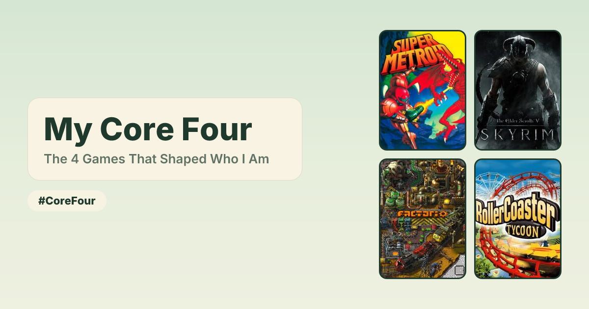

# Core Four

Pick the four games that shaped you and share them as a 2×2 poster.

**Live:** [corefour.mwarger.workers.dev](https://corefour.mwarger.workers.dev) · `#CoreFour`



## What it does

- Search IGDB and drop four games into the poster. Drag tiles (or use Shift+arrow keys) to reorder.
- Pick a subtitle from a set of presets, like "The 4 Games That Shaped Who I Am" or "Desert Island Picks".
- Download the poster as a PNG, or share a link. Shared links unfurl on X, iMessage, Discord, and so on with a preview of your picks.
- Anyone viewing a shared poster can remix it into their own.

There is deliberately no free text anywhere. Titles are fixed per category, subtitles are presets, and every game name and cover comes from IGDB. When a poster is shared, the Worker receives only item IDs and looks them up again itself, so nothing a visitor types can end up on a poster. That keeps it fun to share without needing moderation.

## How it's built

It runs entirely on Cloudflare's free tier. It is also a demo of an all-Effect stack, from the UI to the infrastructure.

| Layer          | What                                                                                     | Where            |
| -------------- | ---------------------------------------------------------------------------------------- | ---------------- |
| Client         | [Foldkit](https://foldkit.dev): the Elm Architecture on [Effect](https://effect.website) | `src/app`        |
| Shared         | Effect Schema types for posters, search results, and the API                             | `src/shared`     |
| Server         | [Hono](https://hono.dev) on Cloudflare Workers                                           | `src/worker`     |
| Infrastructure | [Alchemy](https://alchemy.run) v2, infrastructure as an Effect program                   | `alchemy.run.ts` |

**Client.** A Foldkit app with two pages, the editor (`/`) and a shared poster (`/g/:id`). Each page is a Submodel with its own Model, Messages, and update. The search picker is a `@foldkit/ui` Dialog. Drag-to-swap is hand-rolled on pointer events, because tiles swap in place instead of reordering a list. Side effects live in Commands (the API calls, draft autosave, PNG export, invisible Turnstile), and behavior is covered by Foldkit story and scene tests.

**Shared schema.** The client encodes and the Worker decodes with the same Effect Schemas. A request that doesn't match, such as an unknown subtitle, a malformed ID, or an empty poster, is rejected at the boundary.

**Worker.**

- `/api/search`: IGDB search through a Twitch app token (cached in KV). Results are ranked and cached with the Cache API.
- `/api/img/...`: a same-origin cover proxy, so exporting the poster to PNG doesn't taint the canvas. It only fetches from each source's own image host.
- `POST /api/grids`: rate-limited and Turnstile-verified. It resolves item IDs against IGDB and stores the poster in KV under a content-addressed ID, so sharing the same poster twice gives the same link.
- `/g/:id`: serves the app with per-poster Open Graph tags injected by `HTMLRewriter`.
- `/api/og/:id.png`: a 1200×630 link preview rendered with satori and resvg, pre-rendered to R2 when the poster is shared. The layout is tuned to fit the Free plan's CPU limit; see `src/worker/ogLayout.tsx`.

**Infrastructure.** `alchemy.run.ts` declares the KV namespace, R2 bucket, rate limiter, and the Worker with its static assets. Secrets come from `.env` files through `Config.Redacted`.

## Project layout

```
src/
  app/          Foldkit client
    page/       editor (with the search picker) and shared-poster pages
    resource/   API client, draft storage, PNG export, Turnstile
    domain/     pure poster operations
  shared/       catalog (categories, subtitle presets) and Effect Schemas
  worker/       Hono routes, IGDB source, share storage, OG image rendering
test/           Worker and schema unit tests
repos/foldkit/  vendored Foldkit source, for reference only (git subtree)
```

## Running it locally

You'll need Node 22+, pnpm, a Cloudflare account, and a [Twitch developer app](https://dev.twitch.tv/console/apps) for IGDB access.

```sh
pnpm install
cp .env.example .env              # add your IGDB client ID and secret
pnpm exec alchemy profile edit    # connect your Cloudflare account
pnpm dev                          # http://localhost:1337
```

`.env.example` already has Cloudflare's always-pass Turnstile test secret, and the client uses the matching test site key in dev.

`pnpm check` runs the typecheck, lint, and tests.

## Deploying

Production reads `.env.prod`, which holds the same keys as `.env` plus a real Turnstile secret. If you deploy your own copy, create a Turnstile widget and put its site key in `src/app/resource/turnstile.ts`.

```sh
pnpm run deploy    # not `pnpm deploy`, which is a pnpm builtin
```

This deploys the `prod` stage, which is served at `corefour.<your-subdomain>.workers.dev`.

## Credits

Game data and cover art come from [IGDB](https://www.igdb.com). Inspired by the "My 9" grids that go around on social media.

## License

[MIT](LICENSE). Game names and cover art belong to their owners and are served from IGDB; they aren't covered by this license.
